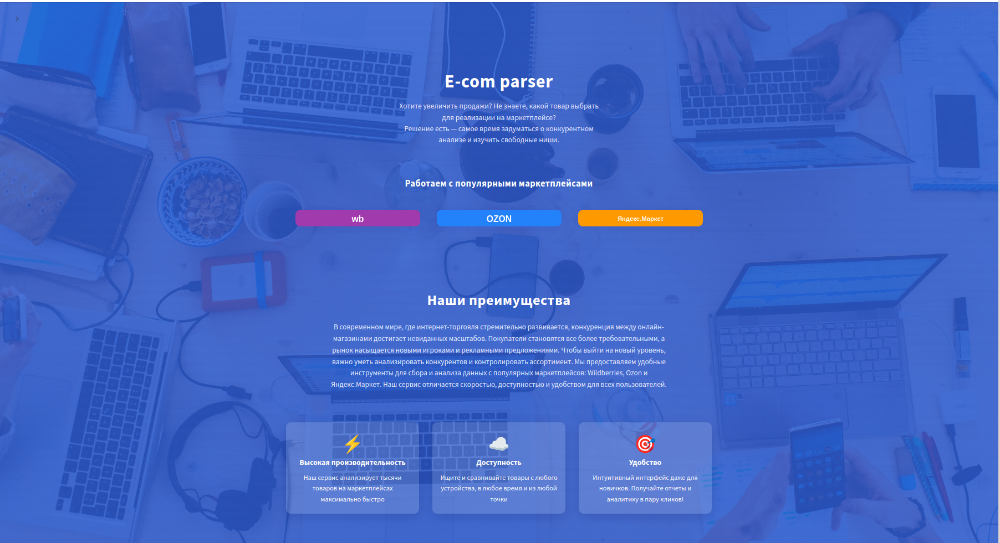
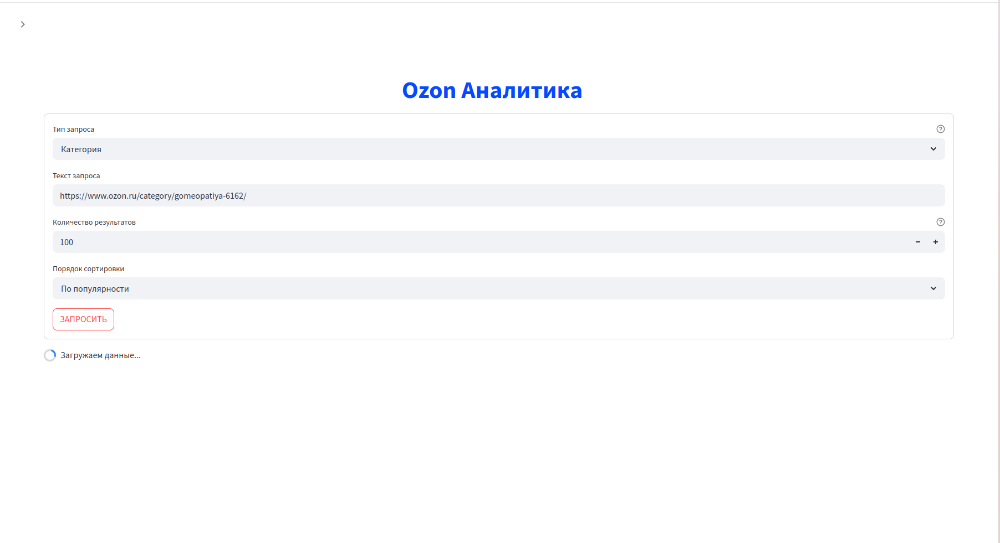
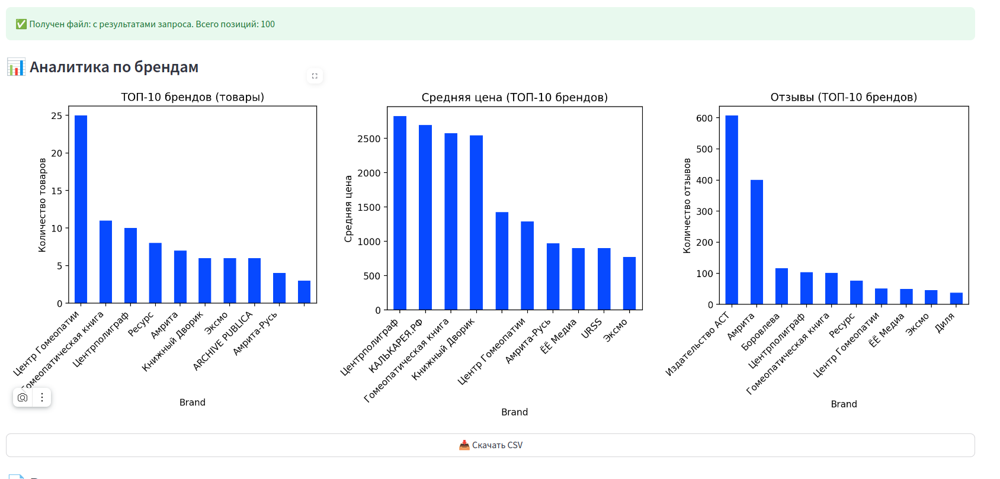
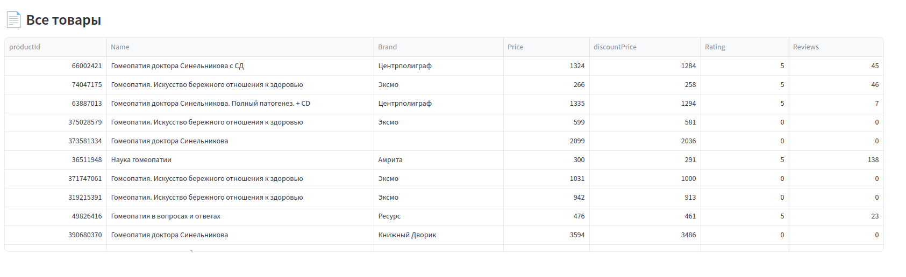

# 📦 КУРСОВОЙ ПРОЕКТ: Парсер поисковой выдачи маркетплейсов

Курсовой проект 3 курса [Факультета Компьютерных наук НИУ ВШЭ](https://cs.hse.ru/).

Цель проекта — разработка распределенного сервиса для сбора и анализа поисковой выдачи крупнейших маркетплейсов России: **Ozon**, **Wildberries** и **Яндекс.Маркет**.

---

## 🏗️ Архитектура проекта

Проект построен на микросервисной архитектуре. Каждый компонент выполняет свою задачу, а взаимодействие организовано через REST/gRPC.

### Кратко о компонентах

- **streamlit_website**  
  Веб-интерфейс пользователя на [Streamlit](https://streamlit.io/).

- **api_gateway**  
  Api шлюз на FastAPI/Uvicorn. Описан через openapi-спецификацию, реализует REST API и маршрутизирует запросы к парсерам через gRPC.

- **wildberries_service**  
  Сервис-парсер поиска маркетплейса Wildberries (gRPC).

- **ozon_service**  
  Сервис-парсер поиска маркетплейса Ozon (gRPC).

- **yamarket_service**  
  Сервис-парсер поиска маркетплейса Яндекс.Маркет (gRPC).

- **website**  
  Прототип сайта на .NET (экспериментальный).

---

## 📸 Скриншоты

<table>
  <tr>
    <td align="center">
        Основная страница сайта
    </td>
    <td align="center">
       Страница парсера ozon
    </td>
  </tr>
  <tr>
    <td align="center">
       Пример результата запроса к парсеру
    </td>
    <td align="center">
       Полученные данные
    </td>
  </tr>
</table>

## 🛠️ Используемые технологии

- **Python** (Streamlit, FastAPI, Selenium, gRPC, undetected-chromedriver, bs4...)
- **.NET** (asp.net core прототип)
- **Docker, Docker Compose**
- **gRPC, REST API (OpenAPI spec)**
- **Streamlit**
- **FastAPI + Uvicorn**
- **Selenium + BeautifulSoup**
- **Linux/MacOS/Windows ready**

---

## 📚 Документация

- Описание REST API: [api_gateway/openapi.yaml](api_gateway/openapi.yaml)

---

## 📝 Авторы

- Максим Кайгородов, НИУ ВШЭ ФКН
---

## ©️ License

Применяется только в учебных/личных целях.

---
