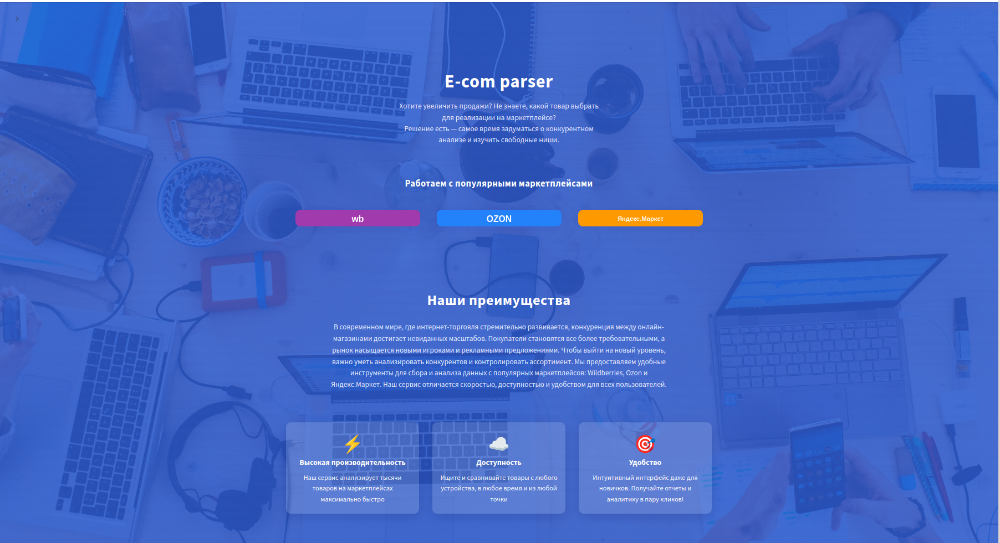
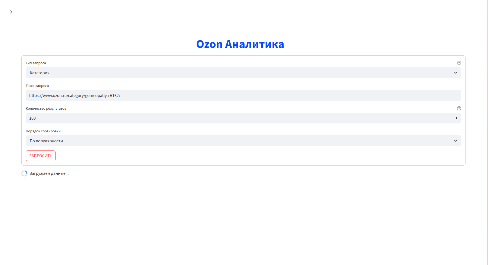
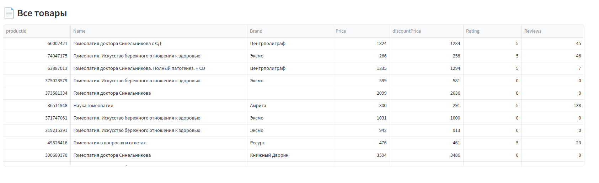
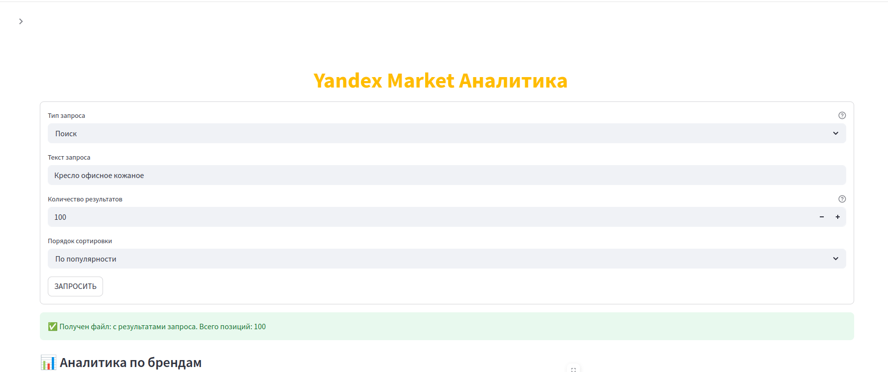
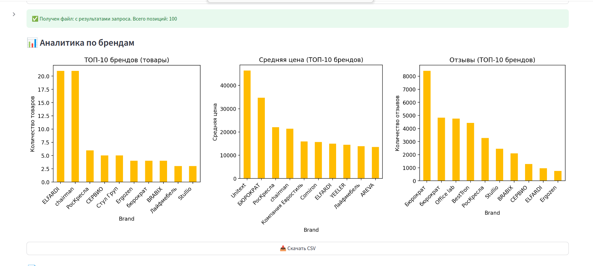
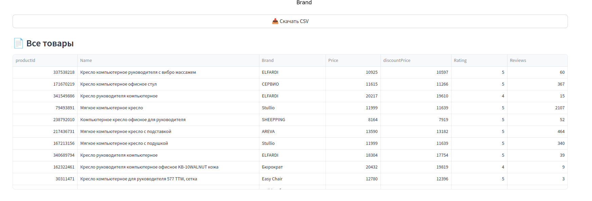

# 🌐 EcomParser Website — Frontend для парсера маркетплейсов

Веб-интерфейс для пользовательской работы с системой сбора поисковой выдачи маркетплейсов (**Ozon**, **Wildberries**, **Яндекс.Маркет**).  
Сделан на [Streamlit](https://streamlit.io/), адаптирован для быстрого локального и облачного запуска.

---

## 📸 Скриншоты

   
  Основная страница сайта

<table>
  <tr>
    <td align="center">
       Страница парсера wildberries
    </td>
    <td align="center">
       Пример результата запроса к парсеру
    </td>
    <td align="center">
       Полученные данные
    </td>
  </tr>
  <tr>
  <td align="center">
       Страница парсера ozon
    </td>
    <td align="center">
       Пример результата запроса к парсеру
    </td>
    <td align="center">
       Полученные данные
    </td>
  </tr>
  <tr>
  <td align="center">
       Страница парсера Яндекс Маркета
    </td>
    <td align="center">
       Пример результата запроса к парсеру
    </td>
    <td align="center">
       Полученные данные
    </td>
  </tr>
</table>

---
