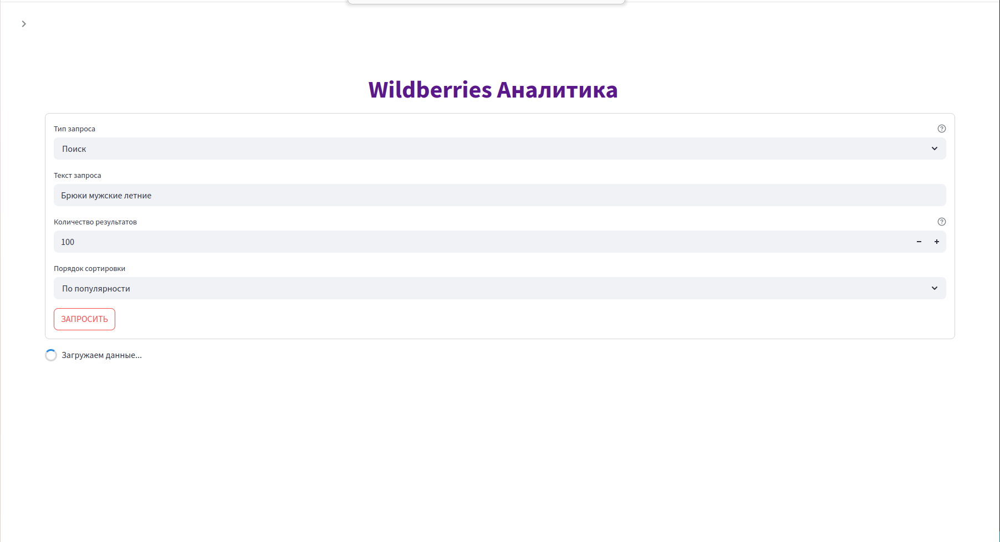
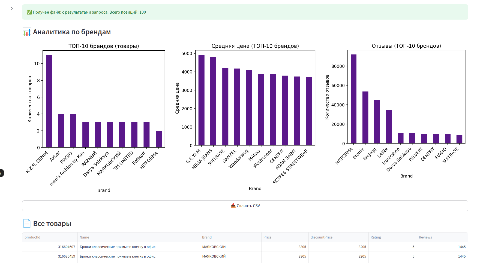
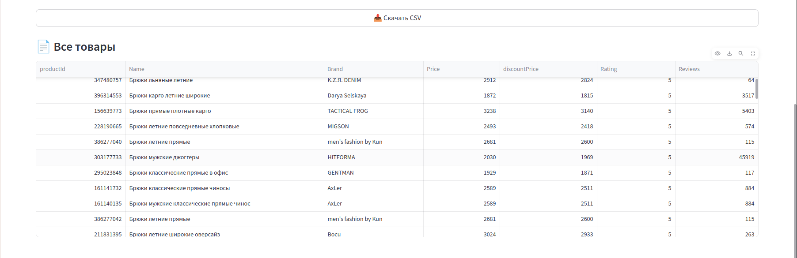

# 🛍️ Wildberries Service

gRPC-сервис-парсер поисковой выдачи маркетплейса [Wildberries.ru](https://www.wildberries.ru/).

Этот микросервис является частью проекта EcomParser (см. [основной проект](../README.md)). Позволяет получать структурированную информацию о товарах Wildberries по поисковому запросу, категории или продавцу.

---

## 📦 Архитектура

- **api/**  
  - Файлы описания gRPC API (`*.proto`)
  - Серверная реализация gRPC-интерфейса

- **models/**  
  - Парсер Wildberries: содержит бизнес-логику поиска товаров, извлечения цен, рейтингов, отзывов и другой информации с сайта Wildberries

---

## 📸 Примеры работы (скриншоты)

   
  Страница парсера wildberries
    
   
  Пример результата запроса к парсеру
    
   
  Пример полученных данных

---
